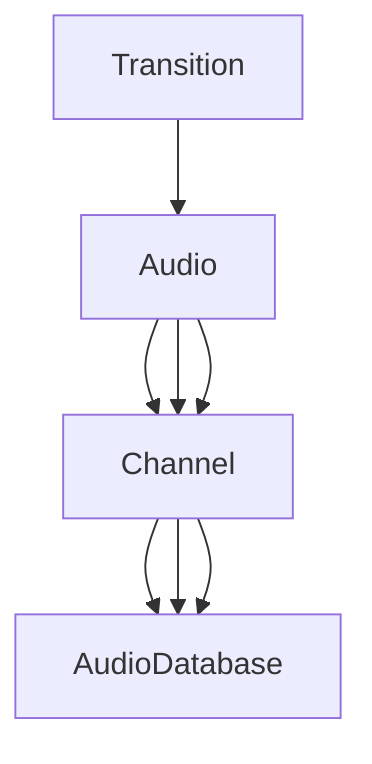

# Mosaic-Toolset

System implementations for Mosaic Dreams projects.

---

## Audio System

### Description

An Audio System to speed up audio development and simplify the process of doing that. There is even a built in transition scriptable object to play effects on your audios.

### namespace

```C#
using Mosaic.Toolset.AudioSystem; // For using system
using Mosaic.Toolset.AudioSystem.Debugging; // For enabling debugging
```

---

## Scriptable Objects

We pushed the Audio development in more visual style to ease things up. So we brought scriptable object to do things with the audios we want to play. There are four different scriptable object that we will go through and explain how they work together.

1. ### **Transiton Scriptable Object :**

    we will fill the datas in this scriptable object to make our transitions. Transition SO will get some information :

    1. Name : This will be your transition name.
    2. Transition IN and OUT : the transition effect that you want to apply will be implemented here. it is an animation curve that will costumize your audio volume in the beggining and the end of that audio.
    3. Transition Duration : The duration of the transition will be set here.  

2. ### **Audio Scriptable Object :**

    You will put your auidos and their informations in this SO.
    this will aquire four things :

    1. Name : This will be your audio's name. Remember this name is important for later becouse if you want to do anything with it, you will call the auido by this name.
    2. Clip : The actual audio clip will be in this slot.
    3. Transition : This will aquire for the scriptable object that we talked about. It is optional to put a transition on your clip, so if you want to play or stop the auido, it will do it with no transition.
    4. Transition Duration Modifire : It will modify the transition duration.

3. ### **Channel Scriptable Object:**

    To group your audios, you will need channels to do this for you. It is also needed for stoping a channel to play. Currently you need to fill four slots :

    1. Name : Again, this will be your channel name and it is important due to call this channel by this name.
    2. Volume : To set the volume of yor channel. you can change it through the game with some methods in the Audio System.
    3. Sources :
    4. Audios : You will store your audios in this array.

4. ### **Auido DataBase :**

    At last, you need to store each channel in this SO. You need to do this because you should configure it in your scripts. Don't worry, it is just one line I promise :) .
    Ok let's see what this one wants :

    1. Name : As allways, your database name and it is important because you need to call it by this name.
    2. Channels : Well, to use your channels, you should add your channels to this array.

I think it may sound like too mutch so let me show you visually :



---

## Config

After all the scriptable objects setting. We will dive right to the code.

```C#
AudioSystem.Config(AudioDatabase audioDatabase);
```

call this method at the start of your game. Before using the Audio System you should configure that. This will set all the channels and after that you can wirk with your channels and their audios.

> **NOTE** : AudioDatabase Scriptable Object can be found in Mosaic Toolset/AudioSystem/AudioDatabase

---

## Methods

So basically after configuring the AudioDatabase using config method, you can use methods for all the channels in the database. there are two types of methods you can use :

1. ### Volume Methods

    1. **Get/Set Channel Volume :** you can change the channels volume through your code or see what the volume is.

    ```C#
    AudioSystem.GetChannelVolume(string ChannelName);
    AudioSystem.SetChannelVolume(string ChannelName, float ChannelVolume);
    ```

    2. **Get/Set Master Volume :** master volume controls all the channels volume, you can change the master volume through your code or see what the master volume is.

    ```C#
    AudioSystem.GetMasterVolume();
    AudioSystem.SetMasterVolume(float MasterVolume);
    ```

2. ### Audio Methods

    1. **Play :** this method creates audio sources and play that channel through the audio source. We combined some functionalities in one method. The play methos can get three things that two of them are set by default. You can play your song with a delay or you can play it sequentially.

    ```C#
    AudioSystem.Play(string audioName, float delay = 0, bool sequential = false);
    AudioSystem.Play(string channelName, string audioName, float delay = 0, bool sequential = false);
    ```

    2. **Play One Shot :** You can even play your sounds with play one shot, this method won't cancel any of playing songs that are currently playing in AudioSource.

    ```C#
    AudioSystem.PlayOneShot(string audioName);
    AudioSystem.PlayOneShot(string channelName, string audioName)
    ```

    3. **Stop Channel :** If you want to stop any playing AudioSource that you played from *Play* or *PlayOneShot*, you can use this method. You can even stop it with delay or without transition.

    ```C#
    AudioSystem.StopChannel(string channelName, bool sudden = false, float delay = 0);
    ```

    4. **Stop All Channels :** This method will stop all the playing channels that you played in code. You can even stop it with delay or without transition.

    ```C#
    AudioSystem.StopAllChannels(bool sudden = false, float delay = 0);
    ```

    5. **IsChannelPlaying :** It will be called when you want to check if a specific channel is playing or not.

    ```C#
    AudioSystem.IsChannelPlaying(string channelName);
    ```

| Method's name | Arguments | Description |
| ------------- | --------- | ----------- |
| `GetChannelVolume` | string | to see what is the desired channel volume|
| `SetChannelVolume` | string | to set the desired channel volume|
| `GetMasterVolume` | string | to see the master volume value|
| `SetMasterVolume` | string | to set the master volume |
| `Play` | string, float, bool | to play the desired auido in audio sources|
| `PlayOneShot` | string | to play the desired auido in one shot and not interrupte any playing audio |
| `StopChannel` | string, bool, float | to stop the desired channel |
| `StopAllChannels` | bool, float | to stop all the playing channels |
|`IsChannelPlaying`| string | check if a specific channel is playing |

---

## Features

- [ ]